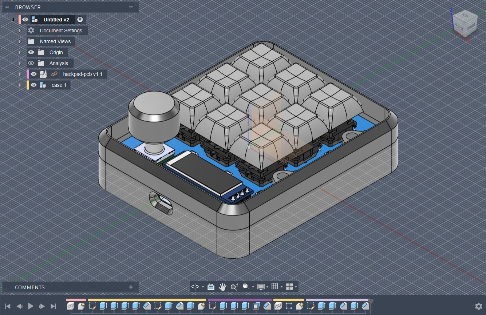
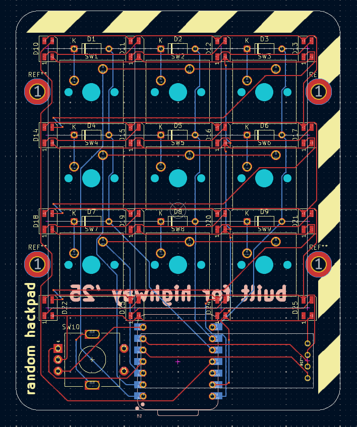
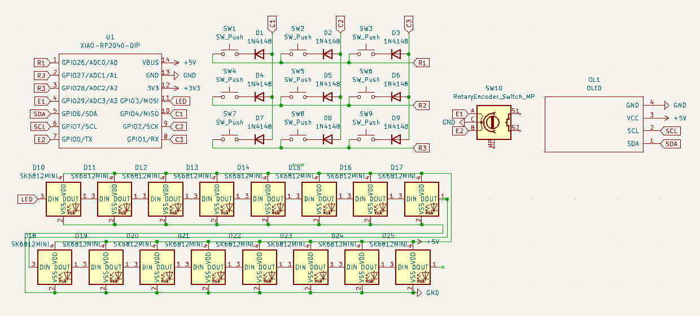

# randompad
randompad is @randomhumandownhere 's submission to the Hackpad YSWS. it has 9 keys, 16 WS2812B LEDs and a 0.91in SSD1306 OLED display (fancy graphics!) as well as an EC11 rotary encoder. it uses KMK firmware too.

## features
- really simple 3d printed case
- 128x32 OLED display
- 16 WS2812B LEDs
- 9 MX style keys
- and an EC11 rotary encoder! 

## cad model!

it uses 4 M3 bolts and heatset inserts to hold it together

## pcb and schematics!

## notes?
i'll probably make a better, more polished one in the future with more features